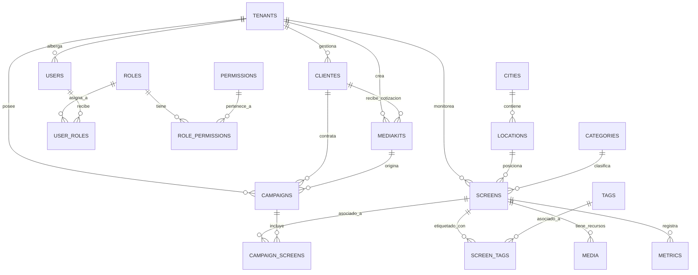

# Documentación del Modelo de Datos (PostgreSQL + Drizzle ORM)

Este documento detalla la arquitectura de persistencia diseñada e implementada para el sistema de gestión publicitaria exterior inteligente (Smart OOH). El esquema está completamente normalizado, optimizado para indexación eficiente, preparado para multi-tenancy y con capacidades de auditoría completas.

---

## 1. Diagrama de Entidad-Relación (ER)

A continuación se muestra el diagrama relacional utilizando sintaxis Mermaid.

---

## 2. Diccionario de Datos del Esquema

### 2.1. Gestión Multi-Inquilino (Multi-Tenant)

#### Tabla: `tenants`
Soporta el aislamiento de datos para marcas blancas independientes.
- `id` (Text, PK): Identificador único global.
- `name` (Text): Nombre del inquilino (ej: "LeadMóvil Mendoza OOH").
- `slug` (Text, Unique): Identificador URL amigable.
- `plan` (Text): Plan de suscripción ("basic", "premium", "enterprise").
- `status` (Text): Estado actual ("active", "suspended", "cancelled").
- `created_at` (Timestamp): Fecha de creación.
- `updated_at` (Timestamp): Fecha de actualización.
- `deleted_at` (Timestamp): Soporte para borrado lógico (Soft Delete).

---

### 2.2. Seguridad y Control de Acceso (RBAC)

#### Tabla: `roles`
- `id` (Text, PK): Identificador único del rol.
- `name` (Text): Nombre legible ("Administrador", "Ejecutivo Comercial").
- `slug` (Text, Unique): Clave para comprobaciones internas en el código.
- `description` (Text): Explicación del alcance del rol.

#### Tabla: `permissions`
- `id` (Text, PK): Identificador único del permiso.
- `name` (Text): Nombre legible.
- `slug` (Text, Unique): Acción permitida (ej: `sync_slides`, `edit_campaigns`).

#### Tabla: `user_roles` (Tabla Pivot)
- `user_id` (Integer, FK -> `users.id` con ON DELETE CASCADE): ID de usuario de base de datos.
- `role_id` (Text, FK -> `roles.id` con ON DELETE CASCADE): ID de rol asignado.
- *Clave Primaria Compuesta:* `(user_id, role_id)`.

#### Tabla: `role_permissions` (Tabla Pivot)
- `role_id` (Text, FK -> `roles.id` con ON DELETE CASCADE).
- `permission_id` (Text, FK -> `permissions.id` con ON DELETE CASCADE).
- *Clave Primaria Compuesta:* `(role_id, permission_id)`.

---

### 2.3. Estructura de Inventario y Soportes (Advertising Spaces)

#### Tabla: `cities`
- `id` (Text, PK): Identificador de la ciudad ("mendoza", "buenos-aires").
- `name` (Text): Nombre ("Mendoza", "Buenos Aires").
- `slug` (Text, Unique): Slug para URL.

#### Tabla: `categories`
- `id` (Text, PK): "pantallas-led", "tradicionales", "led-movil".
- `name` (Text): Nombre comercial.

#### Tabla: `locations`
- `id` (Text, PK): Identificador de la locación física.
- `city_id` (Text, FK -> `cities.id`): Ciudad asociada.
- `name` (Text): Nombre identificador.
- `address` (Text): Dirección postal.
- `lat` / `lng` (Double Precision): Coordenadas GPS de precisión decimal para mapas.

#### Tabla: `screens` (Advertising Spaces / Soportes)
- `id` (Text, PK): Clave única identificadora.
- `tenant_id` (Text, FK -> `tenants.id`): Inquilino dueño del soporte.
- `nombre` (Text).
- `zona` (Text).
- `tipo` (Text): Peatonal, Vehicular, Mixto o Móvil.
- `categoria` (Text).
- `ciudad` (Text).
- `impactos` (Integer): Cantidad promedio de impresiones semanales.
- `precio` (Integer): Tarifa semanal sugerida.
- `status` (Text): Estado operativo ("Activo", "Mantenimiento").
- `dimensiones` (Text).
- `brillo` / `refresh_rate` / `formato` (Text).
- `cobertura` (Text).
- `ruta` (Text): Polígono de recorrido (en caso de soportes móviles).

---

### 2.4. Clientes y Campañas Publicitarias

#### Tabla: `clientes`
- `id` (Text, PK).
- `tenant_id` (Text, FK -> `tenants.id`).
- `nombre` (Text): Representante comercial.
- `empresa` (Text): Razón social del anunciante.
- `email` (Text).
- `telefono` (Text).
- `categoria` (Text): Corporativo, Agencia o Directo.

#### Tabla: `campaigns`
- `id` (Text, PK).
- `tenant_id` (Text, FK -> `tenants.id`).
- `cliente_id` (Text, FK -> `clientes.id`).
- `media_kit_id` (Text, FK -> `mediakits.id`): Media kit u oferta que originó la campaña.
- `nombre` (Text).
- `presupuesto` (Integer): Presupuesto total asignado.
- `estado` (Text): Planificación, Activa, Finalizada o Pausada.
- `fecha_inicio` / `fecha_fin` (Text).

#### Tabla: `campaign_screens` (Inventario de Campaña)
- `campaign_id` (Text, FK -> `campaigns.id` con ON DELETE CASCADE).
- `screen_id` (Text, FK -> `screens.id` con ON DELETE CASCADE).
- `precio_acordado` (Integer): Tarifa negociada específica para esta pauta.
- `fecha_inicio_soporte` / `fecha_fin_soporte` (Text): Duración individual de la pantalla en la pauta.
- *Clave Primaria Compuesta:* `(campaign_id, screen_id)`.

---

### 2.5. Recursos Multimedia, Etiquetas y Métricas de Rendimiento

#### Tabla: `tags`
- `id` (Text, PK).
- `name` (Text): Nombre descriptivo ("Alta Velocidad", "Premium ABC1").
- `slug` (Text, Unique).

#### Tabla: `screen_tags` (Tabla Pivot)
- `screen_id` (Text, FK -> `screens.id` con ON DELETE CASCADE).
- `tag_id` (Text, FK -> `tags.id` con ON DELETE CASCADE).
- *Clave Primaria Compuesta:* `(screen_id, tag_id)`.

#### Tabla: `media` (Fotos, Drone Footages y Videos)
- `id` (Text, PK).
- `screen_id` (Text, FK -> `screens.id` con ON DELETE CASCADE).
- `type` (Text): Tipo de archivo ("image", "video", "drone").
- `url` (Text): Enlace directo de almacenamiento.
- `title` (Text).
- `size_bytes` (Integer).
- `is_hero` (Boolean): Marca la foto de portada para el catálogo o presentación.

#### Tabla: `metrics` (Métricas de Tránsito e Impresiones)
Soporta el análisis temporal y reportería de rendimiento.
- `id` (Text, PK).
- `screen_id` (Text, FK -> `screens.id` con ON DELETE CASCADE).
- `metric_type` (Text): "impressions", "occupancy_rate", "ctr", "views".
- `value` (Double Precision): Valor flotante de la métrica.
- `recorded_at` (Timestamp): Instante exacto del muestreo de datos.

---

## 3. Estrategias de Auditoría e Integridad

1. **Borrado Lógico (Soft Delete):**
   Las entidades críticas como `tenants`, `cities`, `categories`, `locations` y `campaigns` cuentan con una columna `deleted_at`. Las eliminaciones modifican este timestamp en vez de purgar la fila física, permitiendo auditar registros históricos y realizar rollbacks inmediatos.

2. **Integridad de Datos en Cascada (Cascading Deletes):**
   Las tablas pivote (`user_roles`, `role_permissions`, `screen_tags`, `campaign_screens`) y dependientes operacionales directas (`media`, `metrics`) usan `onDelete: "cascade"`. Si se da de baja una pantalla o un rol, toda la metadata secundaria se limpia de forma atómica a nivel de base de datos para prevenir registros huérfanos.

3. **Optimización con Índices B-Tree:**
   Se crearon índices sobre columnas de alta frecuencia de búsqueda y filtrado:
   - `tenants(slug)` para login y resolución de subdominios/inquilinos.
   - `roles(slug)` y `permissions(slug)` para control de autorización inmediato.
   - `campaigns(tenant_id, cliente_id, estado)` para cargas rápidas de pipelines y KPIs en paneles gerenciales.
   - `media(screen_id)` y `metrics(screen_id)` para un renderizado de galerías y gráficos sumamente ágil.
